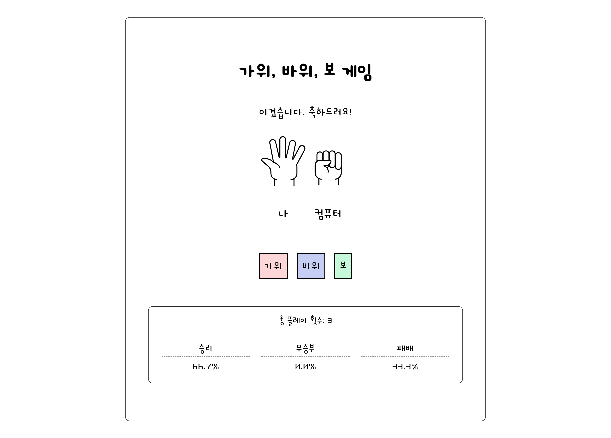

<!--
# Rock Scissors Paper
    [](https://github.com/salutJuillet/rockscissorspaper)
-->


<!-- ABOUT THE PROJECT -->
# Rock Scissors Paper

<div align="center">
   <br/>
  <a href="https://youtu.be/AzfwTlsCn9A" target="_blank">https://youtu.be/AzfwTlsCn9A</a>
</div>

<br/><br/>


## Built With

[][html-url]  
[][css-url]  
[][javascript-url]  
<br/><br/>


<!-- GETTING STARTED -->
## Getting Started

### How to Access

1. Clone the repo
   ```sh
   git clone https://github.com/salutJuillet/rockscissorspaper.git
   ```
2. Open file index.html
   
<br/>


<!-- USAGE EXAMPLES -->
<!--
	# Usage
	Use this space to show useful examples of how a project can be used. Additional screenshots, code examples and demos work well in this space. You may also link to more resources.
-->


<!-- CONTRIBUTING -->
## Contributing

Contributions are what make the open source community such an amazing place to learn, inspire, and create. Any contributions you make are **greatly appreciated**.

If you have a suggestion that would make this better, please fork the repo and create a pull request. You can also simply open an issue with the tag "enhancement".
Don't forget to give the project a star! Thanks again!

1. Fork the Project
2. Create your Feature Branch (`git checkout -b feature/AmazingFeature`)
3. Commit your Changes (`git commit -m 'Add some AmazingFeature'`)
4. Push to the Branch (`git push origin feature/AmazingFeature`)
5. Open a Pull Request
<br/>


<!-- CONTACT -->
## Contact

 salut.juilllet@gmail.com


 [https://github.com/salutJuillet](https://github.com/salutJuillet)


<!-- MARKDOWN LINKS & IMAGES -->
<!-- https://www.markdownguide.org/basic-syntax/#reference-style-links -->
[html-url]: https://www.w3.org/
[css-url]: https://www.w3.org/Style/CSS/#specs
[javascript-url]: https://www.ecma-international.org/
